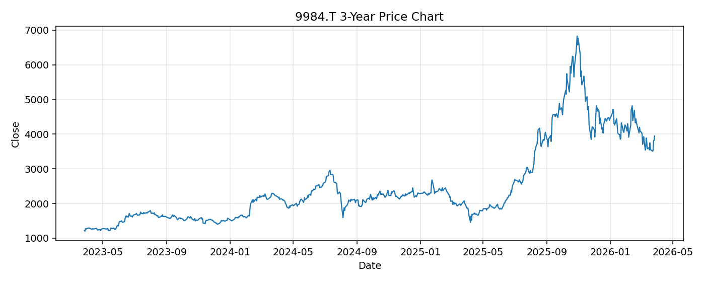

# 9984.T レポート

> このページの目的: 単一銘柄のファンダメンタル・価格推移・ニュースを確認し、候補採用可否を判断する。

- 最終更新: 2026-03-29 08:32:57 JST
- 実行ID: 2026-03-29-083257

## 基本情報

- **longName**: SoftBank Group Corp.
- **symbol**: 9984.T
- **sector**: Communication Services
- **industry**: Telecom Services
- **country**: Japan
- **marketCap**: 22487322591232

## 株価チャート（3年）

## yfinance ニュース

1. [None](None)
2. [None](None)
3. [None](None)
4. [None](None)
5. [None](None)

## NewsAPI ニュース

- NewsAPI でニュースが取得されませんでした。
