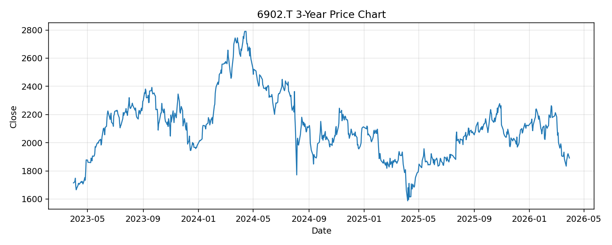

# 6902.T レポート

> このページの目的: 単一銘柄のファンダメンタル・価格推移・ニュースを確認し、候補採用可否を判断する。

- 最終更新: 2026-03-31 16:39:51 JST
- 実行ID: 2026-03-31-163951

## 基本情報

- **longName**: DENSO Corporation
- **symbol**: 6902.T
- **sector**: Consumer Cyclical
- **industry**: Auto Parts
- **country**: Japan
- **marketCap**: 5237653897216

## 株価チャート（3年）

## 主要指標

- [指標の見方ヘルプ](../../../../indicators.md)

| 指標 | 値 |
|---|---:|
| PER | 15.32 |
| 配当利回り | 338.00% |
| PBR | 0.99 |
| ROE | 7.89% |
| Debt/Equity | 17.64 |
| 売上成長率 | 5.00% |
| Beta | 0.58 |

## yfinance ニュース

1. [None](None)
2. [None](None)
3. [None](None)
4. [None](None)
5. [None](None)

## NewsAPI ニュース

- NewsAPI でニュースが取得されませんでした。
