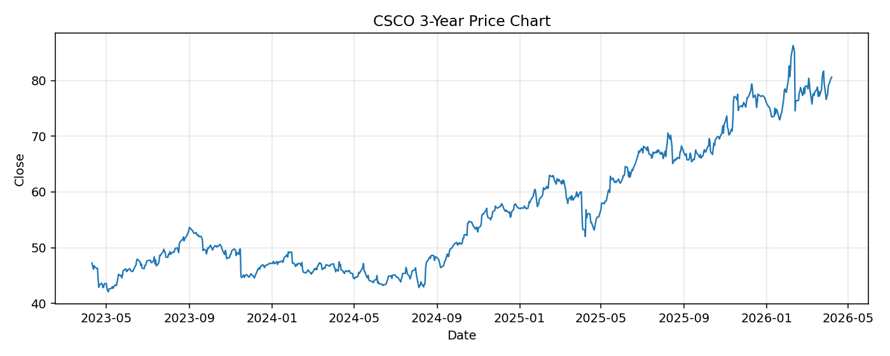

# CSCO レポート

> このページの目的: 単一銘柄のファンダメンタル・価格推移・ニュースを確認し、候補採用可否を判断する。

- 最終更新: 2026-04-07 16:39:12 JST
- 実行ID: 2026-04-07-163912

## 基本情報

- **longName**: Cisco Systems, Inc.
- **symbol**: CSCO
- **sector**: Technology
- **industry**: Communication Equipment
- **country**: United States
- **marketCap**: 318537236480

## 株価チャート（3年）

## 主要指標

- [指標の見方ヘルプ](../../../../indicators.md)

| 指標 | 値 |
|---|---:|
| PER | 29.00 |
| 配当利回り | 213.00% |
| PBR | 6.67 |
| ROE | 23.75% |
| Debt/Equity | 66.51 |
| 売上成長率 | 9.70% |
| Beta | 0.82 |

## yfinance ニュース

1. [None](None)
2. [None](None)
3. [None](None)
4. [None](None)
5. [None](None)

## NewsAPI ニュース

- NewsAPI でニュースが取得されませんでした。
