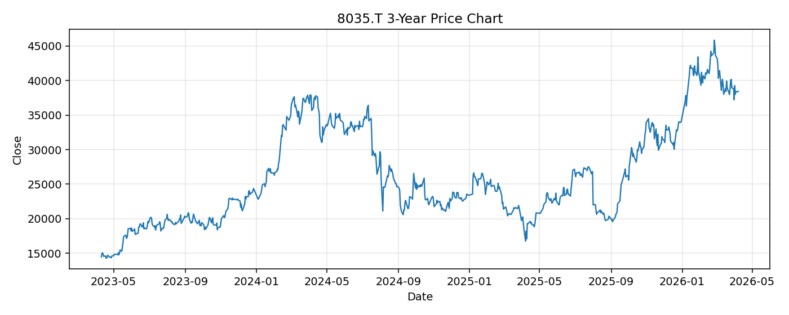

# 8035.T レポート

> このページの目的: 単一銘柄のファンダメンタル・価格推移・ニュースを確認し、候補採用可否を判断する。

- 最終更新: 2026-04-08 16:49:33 JST
- 実行ID: 2026-04-08-164933

## 基本情報

- **longName**: Tokyo Electron Limited
- **symbol**: 8035.T
- **sector**: Technology
- **industry**: Semiconductor Equipment & Materials
- **country**: Japan
- **marketCap**: 19373616005120

## 株価チャート（3年）

## 主要指標

- [指標の見方ヘルプ](../../../../indicators.md)

| 指標 | 値 |
|---|---:|
| PER | 36.05 |
| 配当利回り | 156.00% |
| PBR | 9.70 |
| ROE | 26.46% |
| Debt/Equity | - |
| 売上成長率 | -15.70% |
| Beta | 1.32 |

## yfinance ニュース

1. [None](None)
2. [None](None)
3. [None](None)
4. [None](None)
5. [None](None)

## NewsAPI ニュース

- NewsAPI でニュースが取得されませんでした。
