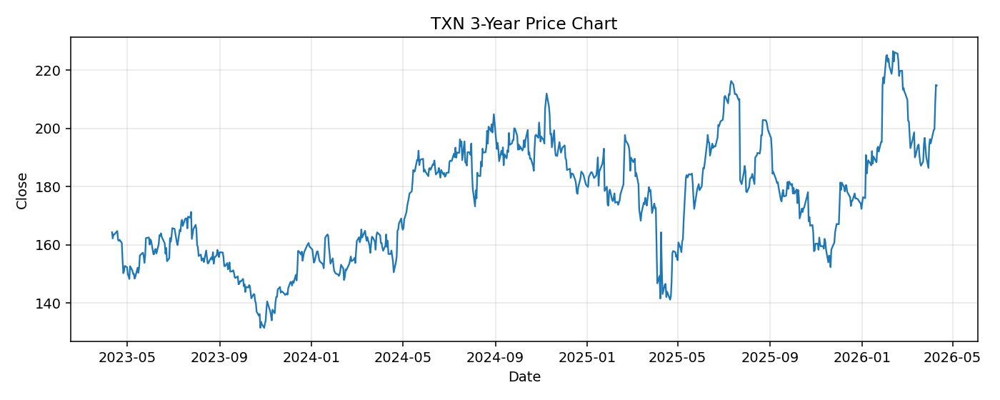

# TXN レポート

> このページの目的: 単一銘柄のファンダメンタル・価格推移・ニュースを確認し、候補採用可否を判断する。

- 最終更新: 2026-04-11 16:03:31 JST
- 実行ID: 2026-04-11-160331

## 基本情報

- **longName**: Texas Instruments Incorporated
- **symbol**: TXN
- **sector**: Technology
- **industry**: Semiconductors
- **country**: United States
- **marketCap**: 195503800320

## 株価チャート（3年）

## 主要指標

- [指標の見方ヘルプ](../../../../indicators.md)

| 指標 | 値 |
|---|---:|
| PER | 39.40 |
| 配当利回り | 265.00% |
| PBR | 11.97 |
| ROE | 30.15% |
| Debt/Equity | 90.82 |
| 売上成長率 | 10.40% |
| Beta | 0.99 |

## yfinance ニュース

1. [None](None)
2. [None](None)
3. [None](None)
4. [None](None)
5. [None](None)

## NewsAPI ニュース

- NewsAPI でニュースが取得されませんでした。
