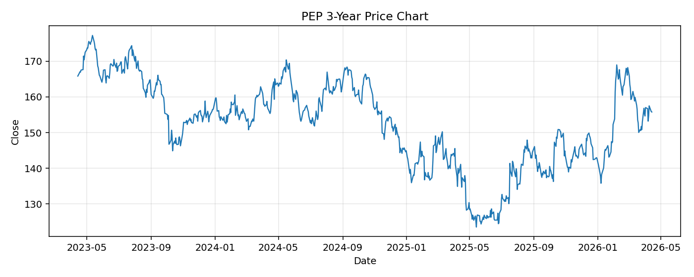

# PEP レポート

> このページの目的: 単一銘柄のファンダメンタル・価格推移・ニュースを確認し、候補採用可否を判断する。

- 最終更新: 2026-04-14 16:45:38 JST
- 実行ID: 2026-04-14-164538

## 基本情報

- **longName**: PepsiCo, Inc.
- **symbol**: PEP
- **sector**: Consumer Defensive
- **industry**: Beverages - Non-Alcoholic
- **country**: United States
- **marketCap**: 212942061568

## 株価チャート（3年）

## 主要指標

- [指標の見方ヘルプ](../../../../indicators.md)

| 指標 | 値 |
|---|---:|
| PER | 25.96 |
| 配当利回り | 365.00% |
| PBR | 10.44 |
| ROE | 42.85% |
| Debt/Equity | 258.08 |
| 売上成長率 | 5.60% |
| Beta | 0.41 |

## yfinance ニュース

1. [None](None)
2. [None](None)
3. [None](None)
4. [None](None)
5. [None](None)

## NewsAPI ニュース

- NewsAPI でニュースが取得されませんでした。
