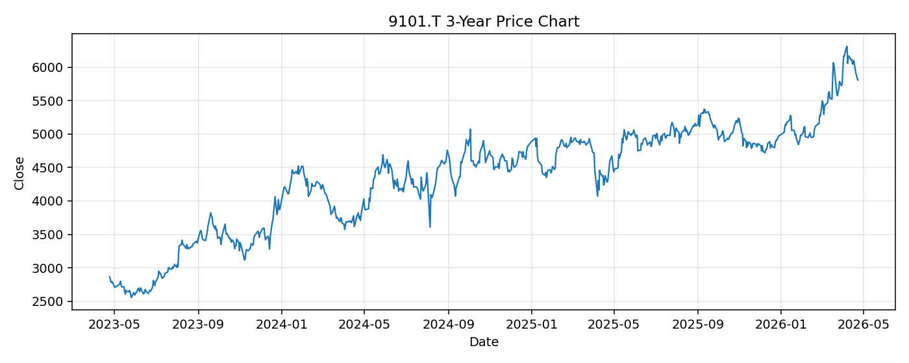

# 9101.T レポート

> このページの目的: 単一銘柄のファンダメンタル・価格推移・ニュースを確認し、候補採用可否を判断する。

- 最終更新: 2026-04-24 16:42:57 JST
- 実行ID: 2026-04-24-164257

## 基本情報

- **longName**: Nippon Yusen Kabushiki Kaisha
- **symbol**: 9101.T
- **sector**: Industrials
- **industry**: Marine Shipping
- **country**: Japan
- **marketCap**: 2381857685504

## 株価チャート（3年）

## 主要指標

- [指標の見方ヘルプ](../../../../indicators.md)

| 指標 | 値 |
|---|---:|
| PER | 8.11 |
| 配当利回り | 344.00% |
| PBR | 0.84 |
| ROE | 7.98% |
| Debt/Equity | 41.55 |
| 売上成長率 | -4.60% |
| Beta | 0.81 |

## yfinance ニュース

1. [None](None)
2. [None](None)
3. [None](None)
4. [None](None)

## NewsAPI ニュース

- NewsAPI でニュースが取得されませんでした。
