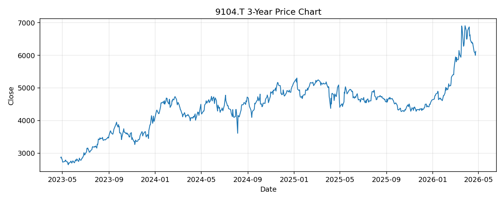

# 9104.T レポート

> このページの目的: 単一銘柄のファンダメンタル・価格推移・ニュースを確認し、候補採用可否を判断する。

- 最終更新: 2026-04-27 17:10:45 JST
- 実行ID: 2026-04-27-171045

## 基本情報

- **longName**: Mitsui O.S.K. Lines, Ltd.
- **symbol**: 9104.T
- **sector**: Industrials
- **industry**: Marine Shipping
- **country**: Japan
- **marketCap**: 1982858133504

## 株価チャート（3年）

## 主要指標

- [指標の見方ヘルプ](../../../../indicators.md)

| 指標 | 値 |
|---|---:|
| PER | 6.90 |
| 配当利回り | 327.00% |
| PBR | 0.73 |
| ROE | 8.87% |
| Debt/Equity | 86.73 |
| 売上成長率 | 13.80% |
| Beta | 0.79 |

## yfinance ニュース

1. [None](None)
2. [None](None)
3. [None](None)
4. [None](None)
5. [None](None)

## NewsAPI ニュース

- NewsAPI でニュースが取得されませんでした。
