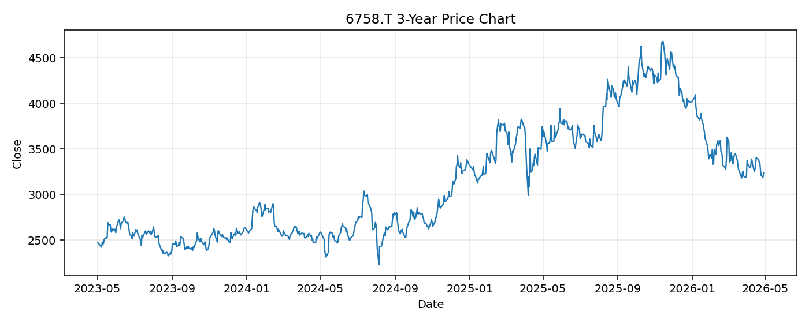

# 6758.T レポート

> このページの目的: 単一銘柄のファンダメンタル・価格推移・ニュースを確認し、候補採用可否を判断する。

- 最終更新: 2026-04-30 17:06:51 JST
- 実行ID: 2026-04-30-170651

## 基本情報

- **longName**: Sony Group Corporation
- **symbol**: 6758.T
- **sector**: Technology
- **industry**: Consumer Electronics
- **country**: Japan
- **marketCap**: 18390569713664

## 株価チャート（3年）

## 主要指標

- [指標の見方ヘルプ](../../../../indicators.md)

| 指標 | 値 |
|---|---:|
| PER | 15.09 |
| 配当利回り | 77.00% |
| PBR | 2.28 |
| ROE | 14.92% |
| Debt/Equity | 19.45 |
| 売上成長率 | 0.50% |
| Beta | 0.75 |

## yfinance ニュース

1. [None](None)
2. [None](None)
3. [None](None)
4. [None](None)
5. [None](None)

## NewsAPI ニュース

- NewsAPI でニュースが取得されませんでした。
