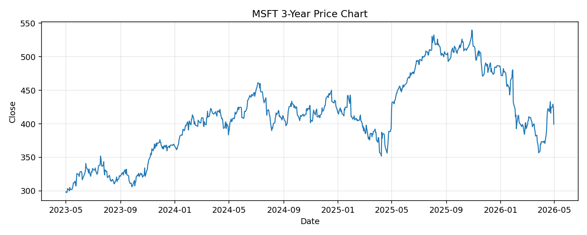

# MSFT レポート

> このページの目的: 単一銘柄のファンダメンタル・価格推移・ニュースを確認し、候補採用可否を判断する。

- 最終更新: 2026-04-30 17:06:51 JST
- 実行ID: 2026-04-30-170651

## 基本情報

- **longName**: Microsoft Corporation
- **symbol**: MSFT
- **sector**: Technology
- **industry**: Software - Infrastructure
- **country**: United States
- **marketCap**: 2968539889664

## 株価チャート（3年）

## 主要指標

- [指標の見方ヘルプ](../../../../indicators.md)

| 指標 | 値 |
|---|---:|
| PER | 25.03 |
| 配当利回り | 86.00% |
| PBR | 7.59 |
| ROE | 34.39% |
| Debt/Equity | 31.54 |
| 売上成長率 | 16.70% |
| Beta | 1.11 |

## yfinance ニュース

1. [None](None)
2. [None](None)
3. [None](None)
4. [None](None)
5. [None](None)

## NewsAPI ニュース

- NewsAPI でニュースが取得されませんでした。
