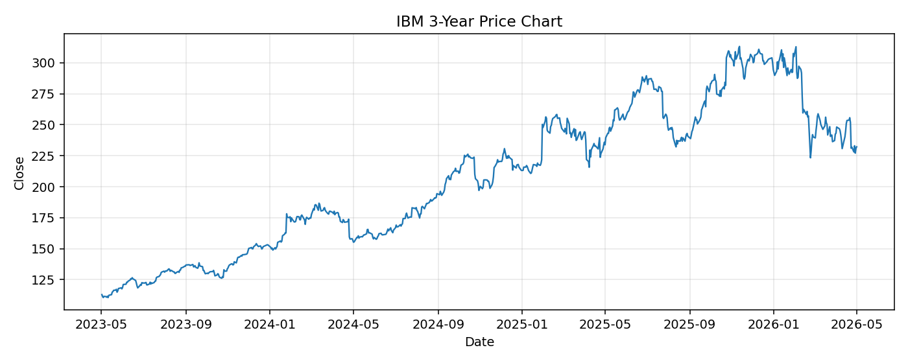

# IBM レポート

> このページの目的: 単一銘柄のファンダメンタル・価格推移・ニュースを確認し、候補採用可否を判断する。

- 最終更新: 2026-05-02 16:32:18 JST
- 実行ID: 2026-05-02-163218

## 基本情報

- **longName**: International Business Machines Corporation
- **symbol**: IBM
- **sector**: Technology
- **industry**: Information Technology Services
- **country**: United States
- **marketCap**: 218241368064

## 株価チャート（3年）

## 主要指標

- [指標の見方ヘルプ](../../../../indicators.md)

| 指標 | 値 |
|---|---:|
| PER | 20.53 |
| 配当利回り | 291.00% |
| PBR | 6.62 |
| ROE | 35.77% |
| Debt/Equity | 211.17 |
| 売上成長率 | 9.50% |
| Beta | 0.69 |

## yfinance ニュース

1. [None](None)
2. [None](None)
3. [None](None)
4. [None](None)
5. [None](None)

## NewsAPI ニュース

- NewsAPI でニュースが取得されませんでした。
