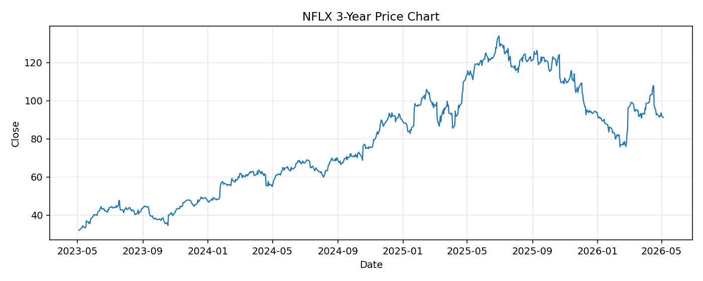

# NFLX レポート

> このページの目的: 単一銘柄のファンダメンタル・価格推移・ニュースを確認し、候補採用可否を判断する。

- 最終更新: 2026-05-04 17:16:36 JST
- 実行ID: 2026-05-04-171636

## 基本情報

- **longName**: Netflix, Inc.
- **symbol**: NFLX
- **sector**: Communication Services
- **industry**: Entertainment
- **country**: United States
- **marketCap**: 383940624384

## 株価チャート（3年）

## 主要指標

- [指標の見方ヘルプ](../../../../indicators.md)

| 指標 | 値 |
|---|---:|
| PER | 29.41 |
| 配当利回り | - |
| PBR | 14.46 |
| ROE | 48.49% |
| Debt/Equity | 53.79 |
| 売上成長率 | 16.20% |
| Beta | 1.55 |

## yfinance ニュース

1. [None](None)
2. [None](None)
3. [None](None)
4. [None](None)
5. [None](None)

## NewsAPI ニュース

- NewsAPI でニュースが取得されませんでした。
