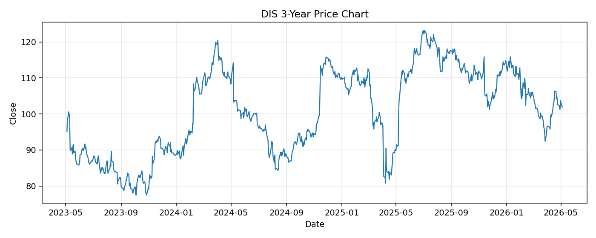

# DIS レポート

> このページの目的: 単一銘柄のファンダメンタル・価格推移・ニュースを確認し、候補採用可否を判断する。

- 最終更新: 2026-05-04 17:18:53 JST
- 実行ID: 2026-05-04-171853

## 基本情報

- **longName**: The Walt Disney Company
- **symbol**: DIS
- **sector**: Communication Services
- **industry**: Entertainment
- **country**: United States
- **marketCap**: 180544454656

## 株価チャート（3年）

## 主要指標

- [指標の見方ヘルプ](../../../../indicators.md)

| 指標 | 値 |
|---|---:|
| PER | 15.01 |
| 配当利回り | 146.00% |
| PBR | 1.67 |
| ROE | 12.02% |
| Debt/Equity | 40.91 |
| 売上成長率 | 5.20% |
| Beta | 1.42 |

## yfinance ニュース

1. [None](None)
2. [None](None)
3. [None](None)
4. [None](None)
5. [None](None)

## NewsAPI ニュース

- NewsAPI でニュースが取得されませんでした。
