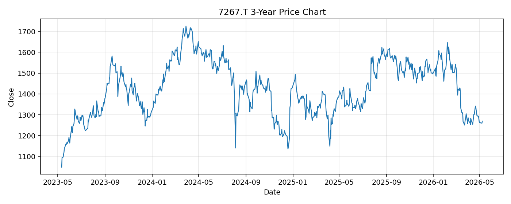

# 7267.T レポート

> このページの目的: 単一銘柄のファンダメンタル・価格推移・ニュースを確認し、候補採用可否を判断する。

- 最終更新: 2026-05-11 17:35:32 JST
- 実行ID: 2026-05-11-173532

## 基本情報

- **longName**: Honda Motor Co., Ltd.
- **symbol**: 7267.T
- **sector**: Consumer Cyclical
- **industry**: Auto Manufacturers
- **country**: Japan
- **marketCap**: 4869581701120

## 株価チャート（3年）

## 主要指標

- [指標の見方ヘルプ](../../../../indicators.md)

| 指標 | 値 |
|---|---:|
| PER | 10.03 |
| 配当利回り | 552.00% |
| PBR | 0.39 |
| ROE | 4.30% |
| Debt/Equity | 106.01 |
| 売上成長率 | -3.40% |
| Beta | 0.27 |

## yfinance ニュース

1. [None](None)
2. [None](None)
3. [None](None)
4. [None](None)
5. [None](None)

## NewsAPI ニュース

- NewsAPI でニュースが取得されませんでした。
