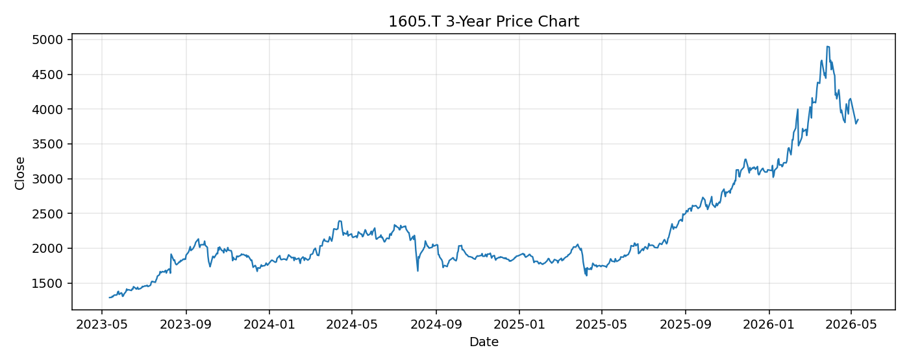

# 1605.T レポート

> このページの目的: 単一銘柄のファンダメンタル・価格推移・ニュースを確認し、候補採用可否を判断する。

- 最終更新: 2026-05-12 17:48:49 JST
- 実行ID: 2026-05-12-174849

## 基本情報

- **longName**: Inpex Corporation
- **symbol**: 1605.T
- **sector**: Energy
- **industry**: Oil & Gas E&P
- **country**: Japan
- **marketCap**: 4583626637312

## 株価チャート（3年）

## 主要指標

- [指標の見方ヘルプ](../../../../indicators.md)

| 指標 | 値 |
|---|---:|
| PER | 11.93 |
| 配当利回り | 281.00% |
| PBR | 0.97 |
| ROE | 8.46% |
| Debt/Equity | 24.78 |
| 売上成長率 | -5.30% |
| Beta | -0.15 |

## yfinance ニュース

1. [None](None)
2. [None](None)
3. [None](None)
4. [None](None)
5. [None](None)

## NewsAPI ニュース

- NewsAPI でニュースが取得されませんでした。
