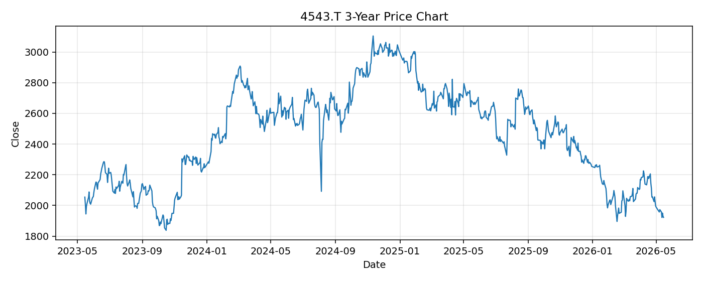

# 4543.T レポート

> このページの目的: 単一銘柄のファンダメンタル・価格推移・ニュースを確認し、候補採用可否を判断する。

- 最終更新: 2026-05-17 16:37:56 JST
- 実行ID: 2026-05-17-163756

## 基本情報

- **longName**: Terumo Corporation
- **symbol**: 4543.T
- **sector**: Healthcare
- **industry**: Medical Instruments & Supplies
- **country**: Japan
- **marketCap**: 2835088670720

## 株価チャート（3年）

## 主要指標

- [指標の見方ヘルプ](../../../../indicators.md)

| 指標 | 値 |
|---|---:|
| PER | 21.69 |
| 配当利回り | 187.00% |
| PBR | 1.86 |
| ROE | 9.21% |
| Debt/Equity | 27.01 |
| 売上成長率 | 13.80% |
| Beta | 0.18 |

## yfinance ニュース

1. [None](None)
2. [None](None)
3. [None](None)
4. [None](None)
5. [None](None)

## NewsAPI ニュース

- NewsAPI でニュースが取得されませんでした。
