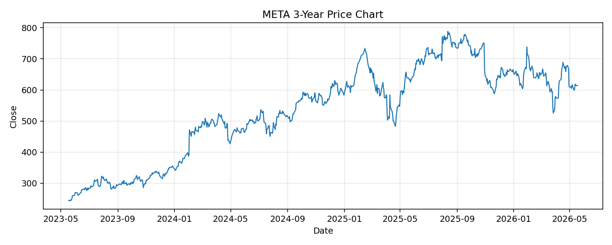

# META レポート

> このページの目的: 単一銘柄のファンダメンタル・価格推移・ニュースを確認し、候補採用可否を判断する。

- 最終更新: 2026-05-18 17:48:17 JST
- 実行ID: 2026-05-18-174817

## 基本情報

- **longName**: Meta Platforms, Inc.
- **symbol**: META
- **sector**: Communication Services
- **industry**: Internet Content & Information
- **country**: United States
- **marketCap**: 1557652701184

## 株価チャート（3年）

## 主要指標

- [指標の見方ヘルプ](../../../../indicators.md)

| 指標 | 値 |
|---|---:|
| PER | 22.30 |
| 配当利回り | 34.00% |
| PBR | 6.39 |
| ROE | 32.93% |
| Debt/Equity | 35.61 |
| 売上成長率 | 33.10% |
| Beta | 1.24 |

## yfinance ニュース

1. [None](None)
2. [None](None)
3. [None](None)
4. [None](None)
5. [None](None)

## NewsAPI ニュース

- NewsAPI でニュースが取得されませんでした。
