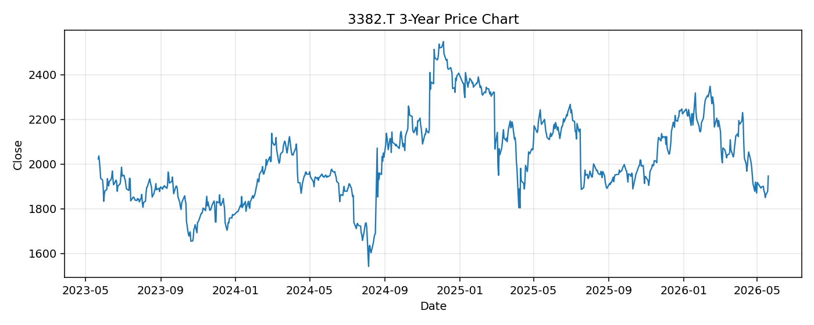

# 3382.T レポート

> このページの目的: 単一銘柄のファンダメンタル・価格推移・ニュースを確認し、候補採用可否を判断する。

- 最終更新: 2026-05-20 18:08:01 JST
- 実行ID: 2026-05-20-180801

## 基本情報

- **longName**: Seven & i Holdings Co., Ltd.
- **symbol**: 3382.T
- **sector**: Consumer Defensive
- **industry**: Grocery Stores
- **country**: Japan
- **marketCap**: 4492749701120

## 株価チャート（3年）

## 主要指標

- [指標の見方ヘルプ](../../../../indicators.md)

| 指標 | 値 |
|---|---:|
| PER | 16.36 |
| 配当利回り | 308.00% |
| PBR | 1.24 |
| ROE | 7.61% |
| Debt/Equity | 103.99 |
| 売上成長率 | -19.00% |
| Beta | 0.07 |

## yfinance ニュース

1. [None](None)
2. [None](None)
3. [None](None)
4. [None](None)
5. [None](None)

## NewsAPI ニュース

- NewsAPI でニュースが取得されませんでした。
