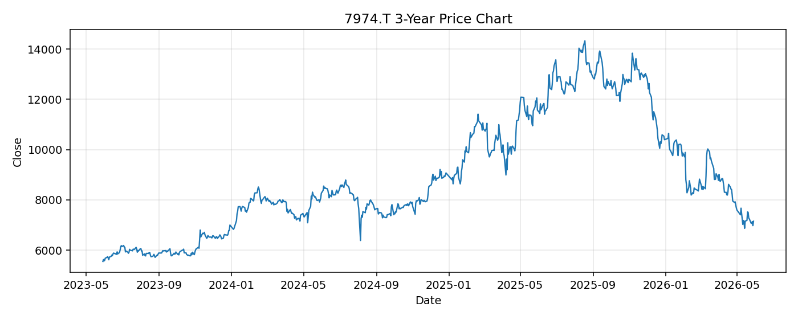

# 7974.T レポート

> このページの目的: 単一銘柄のファンダメンタル・価格推移・ニュースを確認し、候補採用可否を判断する。

- 最終更新: 2026-05-31 16:45:41 JST
- 実行ID: 2026-05-31-164541

## 基本情報

- **longName**: Nintendo Co., Ltd.
- **symbol**: 7974.T
- **sector**: Communication Services
- **industry**: Electronic Gaming & Multimedia
- **country**: Japan
- **marketCap**: 8240421142528

## 株価チャート（3年）

## 主要指標

- [指標の見方ヘルプ](../../../../indicators.md)

| 指標 | 値 |
|---|---:|
| PER | 19.61 |
| 配当利回り | 306.00% |
| PBR | 2.79 |
| ROE | 14.93% |
| Debt/Equity | - |
| 売上成長率 | 95.10% |
| Beta | 0.16 |

## yfinance ニュース

1. [None](None)
2. [None](None)
3. [None](None)
4. [None](None)
5. [None](None)

## NewsAPI ニュース

- NewsAPI でニュースが取得されませんでした。
