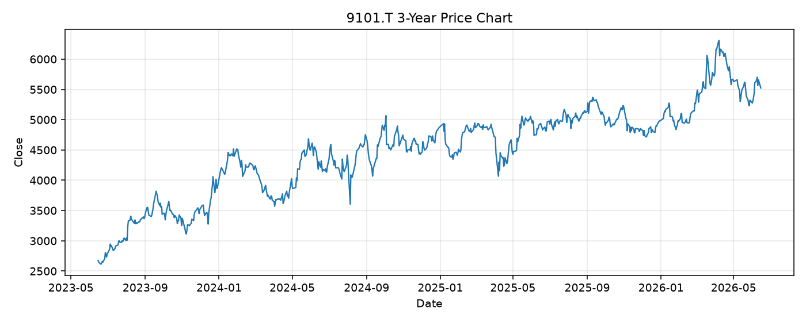

# 9101.T レポート

> このページの目的: 単一銘柄のファンダメンタル・価格推移・ニュースを確認し、候補採用可否を判断する。

- 最終更新: 2026-06-15 19:32:55 JST
- 実行ID: 2026-06-15-193255

## 基本情報

- **longName**: Nippon Yusen Kabushiki Kaisha
- **symbol**: 9101.T
- **sector**: Industrials
- **industry**: Marine Shipping
- **country**: Japan
- **marketCap**: 2229246099456

## 株価チャート（3年）

## 主要指標

- [指標の見方ヘルプ](../../../../indicators.md)

| 指標 | 値 |
|---|---:|
| PER | 11.15 |
| 配当利回り | 355.00% |
| PBR | 0.73 |
| ROE | 7.06% |
| Debt/Equity | 38.22 |
| 売上成長率 | 0.00% |
| Beta | 0.72 |

## yfinance ニュース

1. [None](None)
2. [None](None)
3. [None](None)
4. [None](None)

## NewsAPI ニュース

- NewsAPI でニュースが取得されませんでした。
