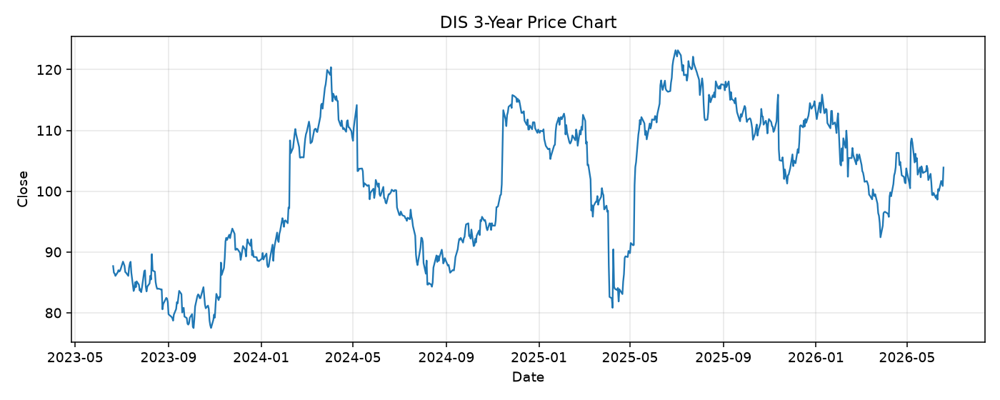

# DIS レポート

> このページの目的: 単一銘柄のファンダメンタル・価格推移・ニュースを確認し、候補採用可否を判断する。

- 最終更新: 2026-06-19 17:45:47 JST
- 実行ID: 2026-06-19-174547

## 基本情報

- **longName**: The Walt Disney Company
- **symbol**: DIS
- **sector**: Communication Services
- **industry**: Entertainment
- **country**: United States
- **marketCap**: 180406173696

## 株価チャート（3年）

## 主要指標

- [指標の見方ヘルプ](../../../../indicators.md)

| 指標 | 値 |
|---|---:|
| PER | 16.62 |
| 配当利回り | 148.00% |
| PBR | 1.67 |
| ROE | 11.01% |
| Debt/Equity | 41.07 |
| 売上成長率 | 6.50% |
| Beta | 1.39 |

## yfinance ニュース

1. [None](None)
2. [None](None)
3. [None](None)
4. [None](None)
5. [None](None)

## NewsAPI ニュース

- NewsAPI でニュースが取得されませんでした。
