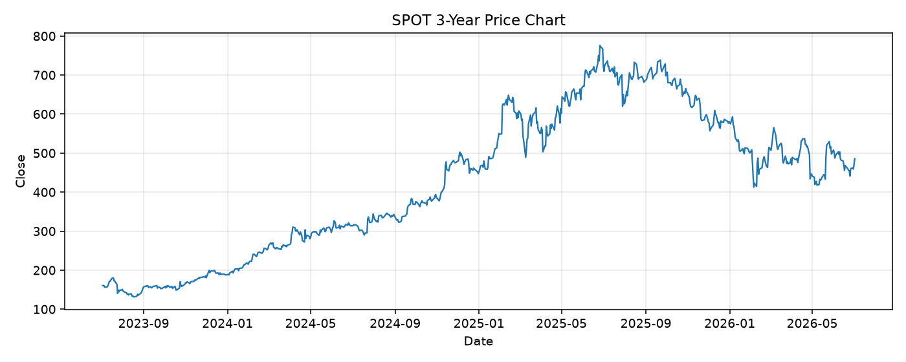

# SPOT レポート

> このページの目的: 単一銘柄のファンダメンタル・価格推移・ニュースを確認し、候補採用可否を判断する。

- 最終更新: 2026-07-03 17:05:38 JST
- 実行ID: 2026-07-03-170538

## 基本情報

- **longName**: Spotify Technology S.A.
- **symbol**: SPOT
- **sector**: Communication Services
- **industry**: Internet Content & Information
- **country**: Sweden
- **marketCap**: 99925180416

## 株価チャート（3年）

## 主要指標

- [指標の見方ヘルプ](../../../../indicators.md)

| 指標 | 値 |
|---|---:|
| PER | 33.10 |
| 配当利回り | - |
| PBR | 10.95 |
| ROE | 37.99% |
| Debt/Equity | 5.94 |
| 売上成長率 | 8.20% |
| Beta | 1.56 |

## yfinance ニュース

1. [None](None)
2. [None](None)
3. [None](None)
4. [None](None)
5. [None](None)

## NewsAPI ニュース

- NewsAPI でニュースが取得されませんでした。
