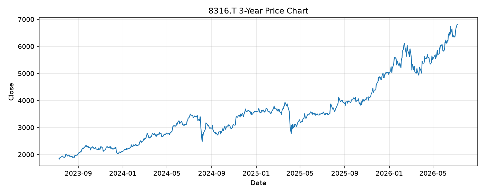

# 8316.T レポート

> このページの目的: 単一銘柄のファンダメンタル・価格推移・ニュースを確認し、候補採用可否を判断する。

- 最終更新: 2026-07-09 17:43:12 JST
- 実行ID: 2026-07-09-174312

## 基本情報

- **longName**: Sumitomo Mitsui Financial Group, Inc.
- **symbol**: 8316.T
- **sector**: Financial Services
- **industry**: Banks - Diversified
- **country**: Japan
- **marketCap**: 25982597595136

## 株価チャート（3年）

## 主要指標

- [指標の見方ヘルプ](../../../../indicators.md)

| 指標 | 値 |
|---|---:|
| PER | 16.54 |
| 配当利回り | 198.00% |
| PBR | 1.64 |
| ROE | 6.87% |
| Debt/Equity | - |
| 売上成長率 | - |
| Beta | 0.38 |

## yfinance ニュース

1. [None](None)
2. [None](None)
3. [None](None)
4. [None](None)
5. [None](None)

## NewsAPI ニュース

- NewsAPI でニュースが取得されませんでした。
