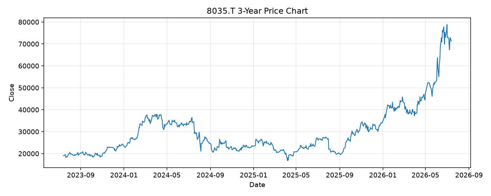

# 8035.T レポート

> このページの目的: 単一銘柄のファンダメンタル・価格推移・ニュースを確認し、候補採用可否を判断する。

- 最終更新: 2026-07-14 16:50:33 JST
- 実行ID: 2026-07-14-165033

## 基本情報

- **longName**: Tokyo Electron Limited
- **symbol**: 8035.T
- **sector**: Technology
- **industry**: Semiconductor Equipment & Materials
- **country**: Japan
- **marketCap**: 32339340034048

## 株価チャート（3年）

## 主要指標

- [指標の見方ヘルプ](../../../../indicators.md)

| 指標 | 値 |
|---|---:|
| PER | 57.01 |
| 配当利回り | 101.00% |
| PBR | 15.63 |
| ROE | 29.27% |
| Debt/Equity | - |
| 売上成長率 | 8.60% |
| Beta | 1.37 |

## yfinance ニュース

1. [None](None)
2. [None](None)
3. [None](None)
4. [None](None)
5. [None](None)

## NewsAPI ニュース

- NewsAPI でニュースが取得されませんでした。
