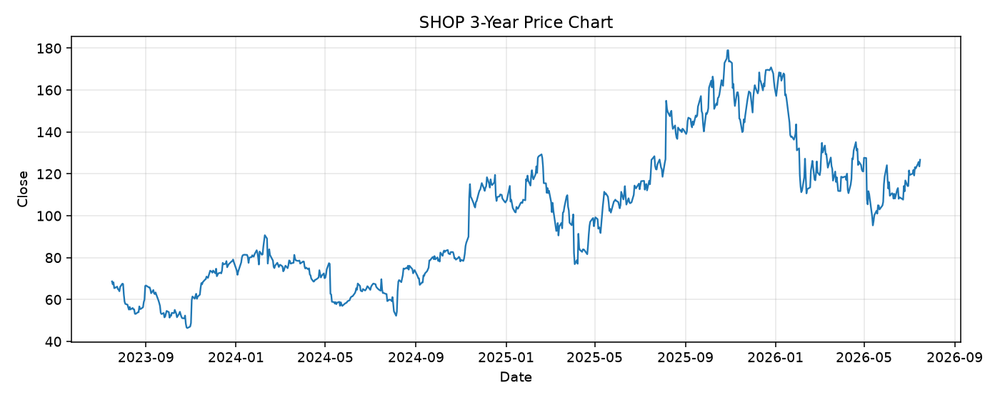

# SHOP レポート

> このページの目的: 単一銘柄のファンダメンタル・価格推移・ニュースを確認し、候補採用可否を判断する。

- 最終更新: 2026-07-16 16:59:04 JST
- 実行ID: 2026-07-16-165904

## 基本情報

- **longName**: Shopify Inc.
- **symbol**: SHOP
- **sector**: Technology
- **industry**: Software - Application
- **country**: Canada
- **marketCap**: 164451778560

## 株価チャート（3年）

## 主要指標

- [指標の見方ヘルプ](../../../../indicators.md)

| 指標 | 値 |
|---|---:|
| PER | 123.04 |
| 配当利回り | - |
| PBR | 13.19 |
| ROE | 11.31% |
| Debt/Equity | 1.43 |
| 売上成長率 | 34.30% |
| Beta | 2.58 |

## yfinance ニュース

1. [None](None)
2. [None](None)
3. [None](None)
4. [None](None)
5. [None](None)

## NewsAPI ニュース

- NewsAPI でニュースが取得されませんでした。
