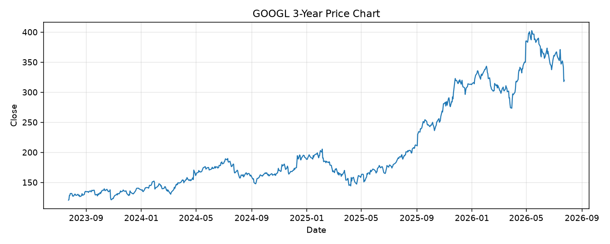

# GOOGL レポート

> このページの目的: 単一銘柄のファンダメンタル・価格推移・ニュースを確認し、候補採用可否を判断する。

- 最終更新: 2026-07-24 17:13:54 JST
- 実行ID: 2026-07-24-171354

## 基本情報

- **longName**: Alphabet Inc.
- **symbol**: GOOGL
- **sector**: Communication Services
- **industry**: Internet Content & Information
- **country**: United States
- **marketCap**: 3914312974336

## 株価チャート（3年）

## 主要指標

- [指標の見方ヘルプ](../../../../indicators.md)

| 指標 | 値 |
|---|---:|
| PER | 16.07 |
| 配当利回り | 26.00% |
| PBR | 6.29 |
| ROE | 48.68% |
| Debt/Equity | 17.61 |
| 売上成長率 | 24.20% |
| Beta | - |

## yfinance ニュース

1. [None](None)
2. [None](None)
3. [None](None)
4. [None](None)
5. [None](None)

## NewsAPI ニュース

- NewsAPI でニュースが取得されませんでした。
