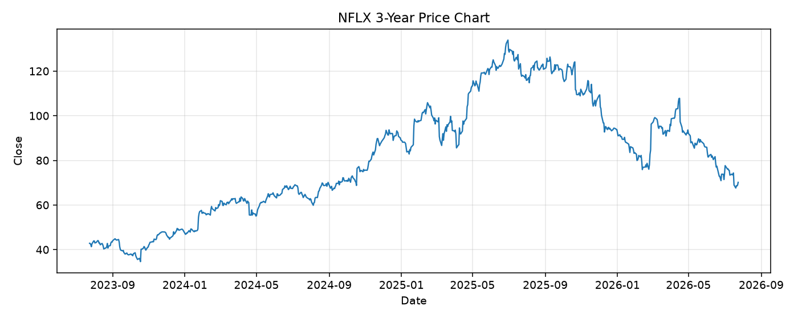

# NFLX レポート

> このページの目的: 単一銘柄のファンダメンタル・価格推移・ニュースを確認し、候補採用可否を判断する。

- 最終更新: 2026-07-24 17:13:54 JST
- 実行ID: 2026-07-24-171354

## 基本情報

- **longName**: Netflix, Inc.
- **symbol**: NFLX
- **sector**: Communication Services
- **industry**: Entertainment
- **country**: United States
- **marketCap**: 292121182208

## 株価チャート（3年）

## 主要指標

- [指標の見方ヘルプ](../../../../indicators.md)

| 指標 | 値 |
|---|---:|
| PER | 22.06 |
| 配当利回り | - |
| PBR | 9.69 |
| ROE | 49.54% |
| Debt/Equity | 55.24 |
| 売上成長率 | 13.40% |
| Beta | 1.52 |

## yfinance ニュース

1. [None](None)
2. [None](None)
3. [None](None)
4. [None](None)
5. [None](None)

## NewsAPI ニュース

- NewsAPI でニュースが取得されませんでした。
