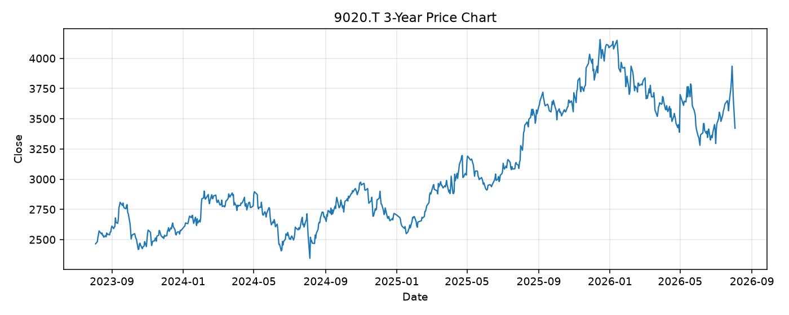

# 9020.T レポート

> このページの目的: 単一銘柄のファンダメンタル・価格推移・ニュースを確認し、候補採用可否を判断する。

- 最終更新: 2026-08-04 17:20:06 JST
- 実行ID: 2026-08-04-172006

## 基本情報

- **longName**: East Japan Railway Company
- **symbol**: 9020.T
- **sector**: Industrials
- **industry**: Railroads
- **country**: Japan
- **marketCap**: 3847865499648

## 株価チャート（3年）

## 主要指標

- [指標の見方ヘルプ](../../../../indicators.md)

| 指標 | 値 |
|---|---:|
| PER | 15.54 |
| 配当利回り | 245.00% |
| PBR | 1.26 |
| ROE | 7.95% |
| Debt/Equity | 162.62 |
| 売上成長率 | 8.00% |
| Beta | 0.05 |

## yfinance ニュース

1. [None](None)
2. [None](None)
3. [None](None)

## NewsAPI ニュース

- NewsAPI でニュースが取得されませんでした。
