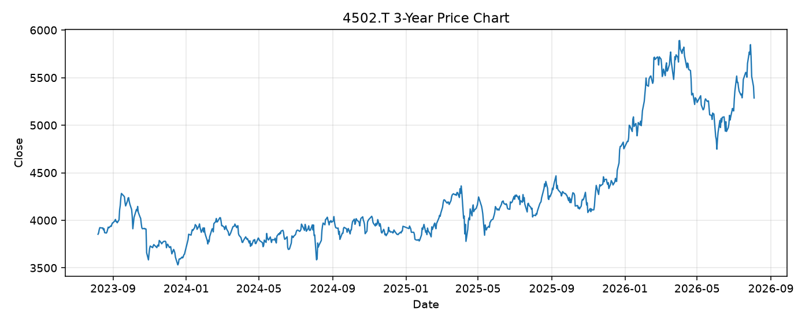

# 4502.T レポート

> このページの目的: 単一銘柄のファンダメンタル・価格推移・ニュースを確認し、候補採用可否を判断する。

- 最終更新: 2026-08-05 17:13:03 JST
- 実行ID: 2026-08-05-171303

## 基本情報

- **longName**: Takeda Pharmaceutical Company Limited
- **symbol**: 4502.T
- **sector**: Healthcare
- **industry**: Drug Manufacturers - Specialty & Generic
- **country**: Japan
- **marketCap**: 8413283614720

## 株価チャート（3年）

## 主要指標

- [指標の見方ヘルプ](../../../../indicators.md)

| 指標 | 値 |
|---|---:|
| PER | - |
| 配当利回り | 386.00% |
| PBR | 1.10 |
| ROE | -2.26% |
| Debt/Equity | 73.25 |
| 売上成長率 | 10.20% |
| Beta | 0.10 |

## yfinance ニュース

1. [None](None)
2. [None](None)
3. [None](None)
4. [None](None)
5. [None](None)

## NewsAPI ニュース

- NewsAPI でニュースが取得されませんでした。
