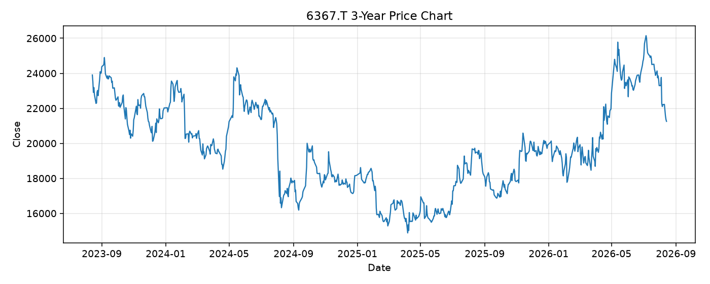

# 6367.T レポート

> このページの目的: 単一銘柄のファンダメンタル・価格推移・ニュースを確認し、候補採用可否を判断する。

- 最終更新: 2026-08-16 16:00:23 JST
- 実行ID: 2026-08-16-160023

## 基本情報

- **longName**: Daikin Industries,Ltd.
- **symbol**: 6367.T
- **sector**: Industrials
- **industry**: Building Products & Equipment
- **country**: Japan
- **marketCap**: 5916034334720

## 株価チャート（3年）

## 主要指標

- [指標の見方ヘルプ](../../../../indicators.md)

| 指標 | 値 |
|---|---:|
| PER | 22.62 |
| 配当利回り | 169.00% |
| PBR | 1.98 |
| ROE | 9.60% |
| Debt/Equity | 39.48 |
| 売上成長率 | - |
| Beta | 0.57 |

## yfinance ニュース

1. [None](None)
2. [None](None)
3. [None](None)
4. [None](None)
5. [None](None)

## NewsAPI ニュース

- NewsAPI でニュースが取得されませんでした。
