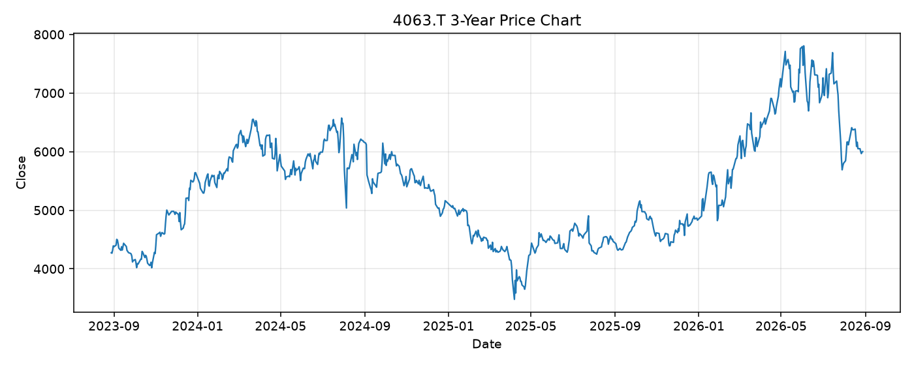

# 4063.T レポート

> このページの目的: 単一銘柄のファンダメンタル・価格推移・ニュースを確認し、候補採用可否を判断する。

- 最終更新: 2026-08-30 18:52:28 JST
- 実行ID: 2026-08-30-185228

## 基本情報

- **longName**: Shin-Etsu Chemical Co., Ltd.
- **symbol**: 4063.T
- **sector**: Basic Materials
- **industry**: Chemicals
- **country**: Japan
- **marketCap**: 11100029452288

## 株価チャート（3年）

## 主要指標

- [指標の見方ヘルプ](../../../../indicators.md)

| 指標 | 値 |
|---|---:|
| PER | 23.75 |
| 配当利回り | 193.00% |
| PBR | 2.45 |
| ROE | 11.23% |
| Debt/Equity | 5.49 |
| 売上成長率 | 5.40% |
| Beta | 1.06 |

## yfinance ニュース

1. [None](None)
2. [None](None)
3. [None](None)
4. [None](None)
5. [None](None)

## NewsAPI ニュース

- NewsAPI でニュースが取得されませんでした。
