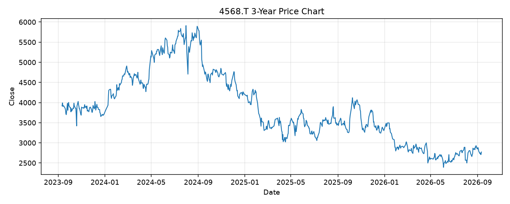

# 4568.T レポート

> このページの目的: 単一銘柄のファンダメンタル・価格推移・ニュースを確認し、候補採用可否を判断する。

- 最終更新: 2026-09-12 17:55:16 JST
- 実行ID: 2026-09-12-175516

## 基本情報

- **longName**: Daiichi Sankyo Company, Limited
- **symbol**: 4568.T
- **sector**: Healthcare
- **industry**: Drug Manufacturers - General
- **country**: Japan
- **marketCap**: 5044078903296

## 株価チャート（3年）

## 主要指標

- [指標の見方ヘルプ](../../../../indicators.md)

| 指標 | 値 |
|---|---:|
| PER | 19.76 |
| 配当利回り | 361.00% |
| PBR | 2.96 |
| ROE | 14.81% |
| Debt/Equity | 29.39 |
| 売上成長率 | 21.10% |
| Beta | - |

## yfinance ニュース

1. [None](None)
2. [None](None)
3. [None](None)
4. [None](None)
5. [None](None)

## NewsAPI ニュース

- NewsAPI でニュースが取得されませんでした。
