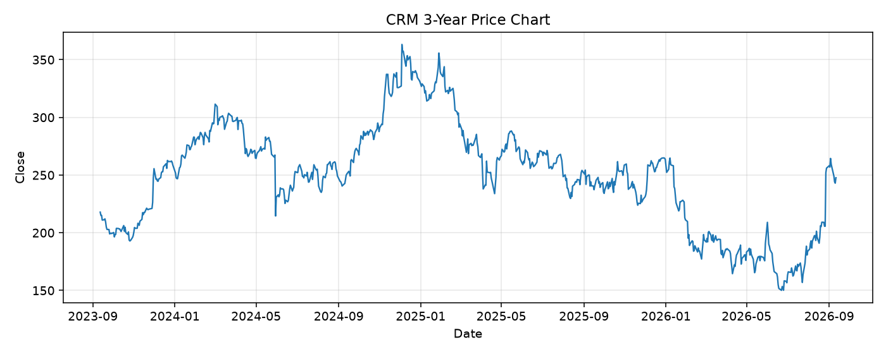

# CRM レポート

> このページの目的: 単一銘柄のファンダメンタル・価格推移・ニュースを確認し、候補採用可否を判断する。

- 最終更新: 2026-09-13 18:20:39 JST
- 実行ID: 2026-09-13-182039

## 基本情報

- **longName**: Salesforce, Inc.
- **symbol**: CRM
- **sector**: Technology
- **industry**: Software - Application
- **country**: United States
- **marketCap**: 203873566720

## 株価チャート（3年）

## 主要指標

- [指標の見方ヘルプ](../../../../indicators.md)

| 指標 | 値 |
|---|---:|
| PER | 22.68 |
| 配当利回り | 71.00% |
| PBR | 5.31 |
| ROE | 19.38% |
| Debt/Equity | 110.42 |
| 売上成長率 | 10.80% |
| Beta | 1.20 |

## yfinance ニュース

1. [None](None)
2. [None](None)
3. [None](None)
4. [None](None)
5. [None](None)

## NewsAPI ニュース

- NewsAPI でニュースが取得されませんでした。
