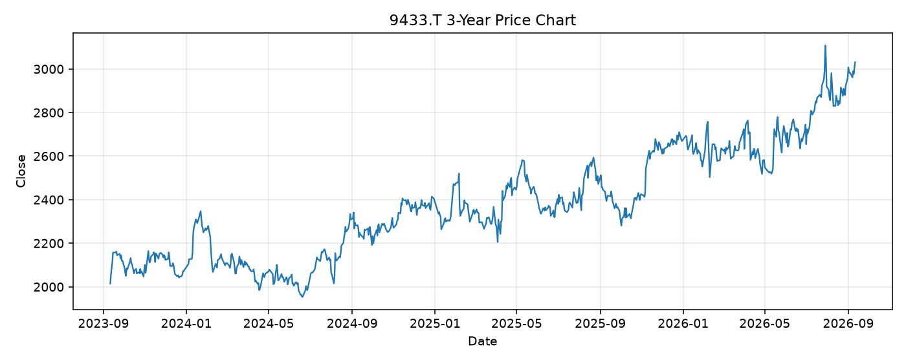

# 9433.T レポート

> このページの目的: 単一銘柄のファンダメンタル・価格推移・ニュースを確認し、候補採用可否を判断する。

- 最終更新: 2026-09-13 18:23:22 JST
- 実行ID: 2026-09-13-182322

## 基本情報

- **longName**: KDDI Corporation
- **symbol**: 9433.T
- **sector**: Communication Services
- **industry**: Telecom Services
- **country**: Japan
- **marketCap**: 11202462744576

## 株価チャート（3年）

## 主要指標

- [指標の見方ヘルプ](../../../../indicators.md)

| 指標 | 値 |
|---|---:|
| PER | 16.50 |
| 配当利回り | 277.00% |
| PBR | 2.25 |
| ROE | 14.59% |
| Debt/Equity | 93.80 |
| 売上成長率 | 3.60% |
| Beta | -0.10 |

## yfinance ニュース

1. [None](None)
2. [None](None)
3. [None](None)
4. [None](None)
5. [None](None)

## NewsAPI ニュース

- NewsAPI でニュースが取得されませんでした。
