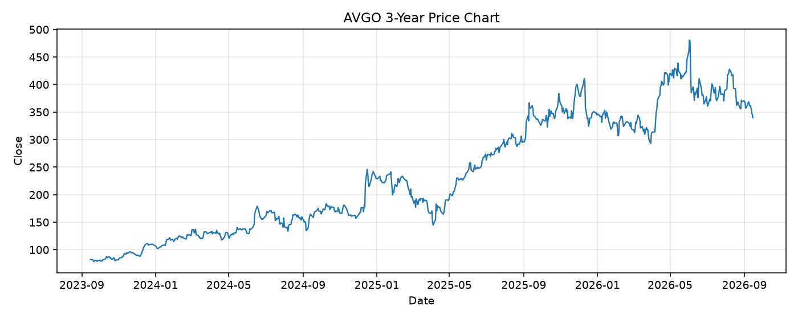

# AVGO レポート

> このページの目的: 単一銘柄のファンダメンタル・価格推移・ニュースを確認し、候補採用可否を判断する。

- 最終更新: 2026-09-15 19:12:40 JST
- 実行ID: 2026-09-15-191240

## 基本情報

- **longName**: Broadcom Inc.
- **symbol**: AVGO
- **sector**: Technology
- **industry**: Semiconductors
- **country**: United States
- **marketCap**: 1622461382656

## 株価チャート（3年）

## 主要指標

- [指標の見方ヘルプ](../../../../indicators.md)

| 指標 | 値 |
|---|---:|
| PER | 43.41 |
| 配当利回り | 75.00% |
| PBR | 16.28 |
| ROE | 44.25% |
| Debt/Equity | 59.60 |
| 売上成長率 | 85.50% |
| Beta | 1.46 |

## yfinance ニュース

1. [None](None)
2. [None](None)
3. [None](None)
4. [None](None)
5. [None](None)

## NewsAPI ニュース

- NewsAPI でニュースが取得されませんでした。
