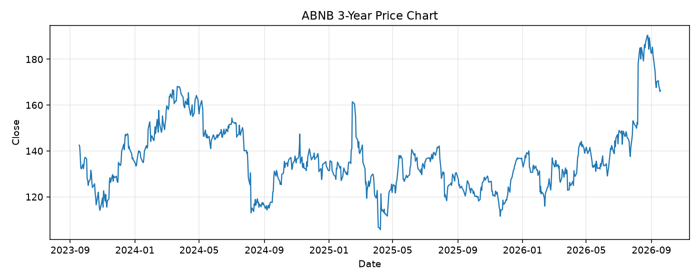

# ABNB レポート

> このページの目的: 単一銘柄のファンダメンタル・価格推移・ニュースを確認し、候補採用可否を判断する。

- 最終更新: 2026-09-18 18:41:11 JST
- 実行ID: 2026-09-18-184111

## 基本情報

- **longName**: Airbnb, Inc.
- **symbol**: ABNB
- **sector**: Consumer Cyclical
- **industry**: Travel Services
- **country**: United States
- **marketCap**: 99622961152

## 株価チャート（3年）

## 主要指標

- [指標の見方ヘルプ](../../../../indicators.md)

| 指標 | 値 |
|---|---:|
| PER | 37.99 |
| 配当利回り | - |
| PBR | 12.59 |
| ROE | 34.54% |
| Debt/Equity | 32.00 |
| 売上成長率 | 16.50% |
| Beta | 1.16 |

## yfinance ニュース

1. [None](None)
2. [None](None)
3. [None](None)
4. [None](None)
5. [None](None)

## NewsAPI ニュース

- NewsAPI でニュースが取得されませんでした。
