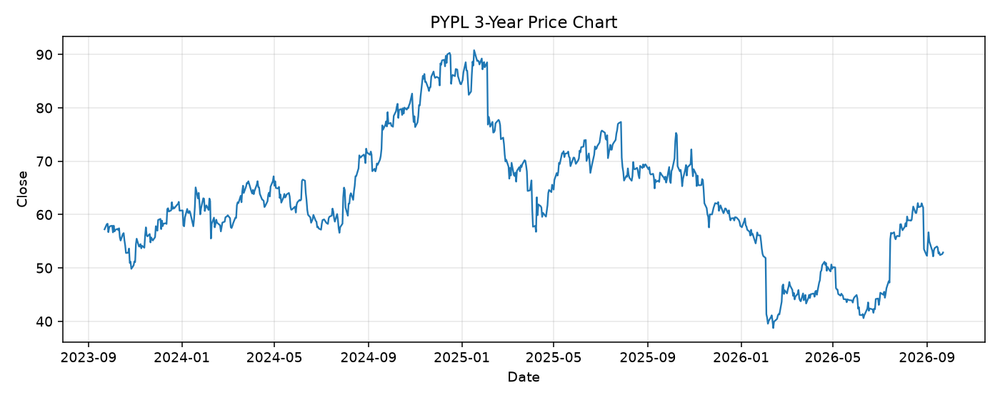

# PYPL レポート

> このページの目的: 単一銘柄のファンダメンタル・価格推移・ニュースを確認し、候補採用可否を判断する。

- 最終更新: 2026-09-22 19:11:05 JST
- 実行ID: 2026-09-22-191105

## 基本情報

- **longName**: PayPal Holdings, Inc.
- **symbol**: PYPL
- **sector**: Financial Services
- **industry**: Credit Services
- **country**: United States
- **marketCap**: 45258153984

## 株価チャート（3年）

## 主要指標

- [指標の見方ヘルプ](../../../../indicators.md)

| 指標 | 値 |
|---|---:|
| PER | 10.00 |
| 配当利回り | 106.00% |
| PBR | 2.30 |
| ROE | 24.50% |
| Debt/Equity | 71.75 |
| 売上成長率 | 4.80% |
| Beta | 1.29 |

## yfinance ニュース

1. [None](None)
2. [None](None)
3. [None](None)
4. [None](None)
5. [None](None)

## NewsAPI ニュース

- NewsAPI でニュースが取得されませんでした。
