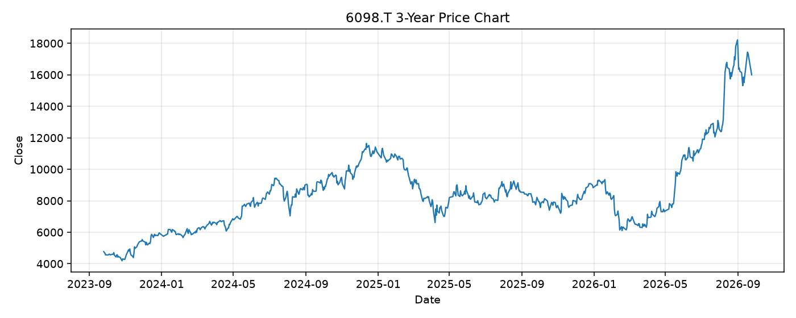

# 6098.T レポート

> このページの目的: 単一銘柄のファンダメンタル・価格推移・ニュースを確認し、候補採用可否を判断する。

- 最終更新: 2026-09-24 19:30:35 JST
- 実行ID: 2026-09-24-193035

## 基本情報

- **longName**: Recruit Holdings Co., Ltd.
- **symbol**: 6098.T
- **sector**: Communication Services
- **industry**: Internet Content & Information
- **country**: Japan
- **marketCap**: 22221913325568

## 株価チャート（3年）

## 主要指標

- [指標の見方ヘルプ](../../../../indicators.md)

| 指標 | 値 |
|---|---:|
| PER | 46.11 |
| 配当利回り | 15.00% |
| PBR | 12.55 |
| ROE | 36.22% |
| Debt/Equity | 10.00 |
| 売上成長率 | 18.90% |
| Beta | 0.95 |

## yfinance ニュース

1. [None](None)
2. [None](None)
3. [None](None)
4. [None](None)
5. [None](None)

## NewsAPI ニュース

- NewsAPI でニュースが取得されませんでした。
