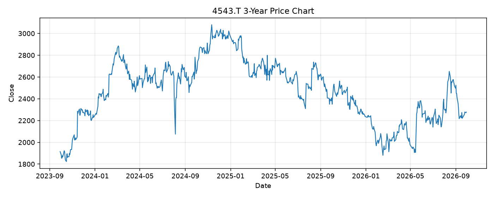

# 4543.T レポート

> このページの目的: 単一銘柄のファンダメンタル・価格推移・ニュースを確認し、候補採用可否を判断する。

- 最終更新: 2026-09-29 20:13:48 JST
- 実行ID: 2026-09-29-201348

## 基本情報

- **longName**: Terumo Corporation
- **symbol**: 4543.T
- **sector**: Healthcare
- **industry**: Medical Devices
- **country**: Japan
- **marketCap**: 3359543656448

## 株価チャート（3年）

## 主要指標

- [指標の見方ヘルプ](../../../../indicators.md)

| 指標 | 値 |
|---|---:|
| PER | 24.87 |
| 配当利回り | 157.00% |
| PBR | 2.02 |
| ROE | 10.85% |
| Debt/Equity | 26.36 |
| 売上成長率 | 19.90% |
| Beta | 0.23 |

## yfinance ニュース

- ニュースが取得できませんでした。

## NewsAPI ニュース

- NewsAPI でニュースが取得されませんでした。
