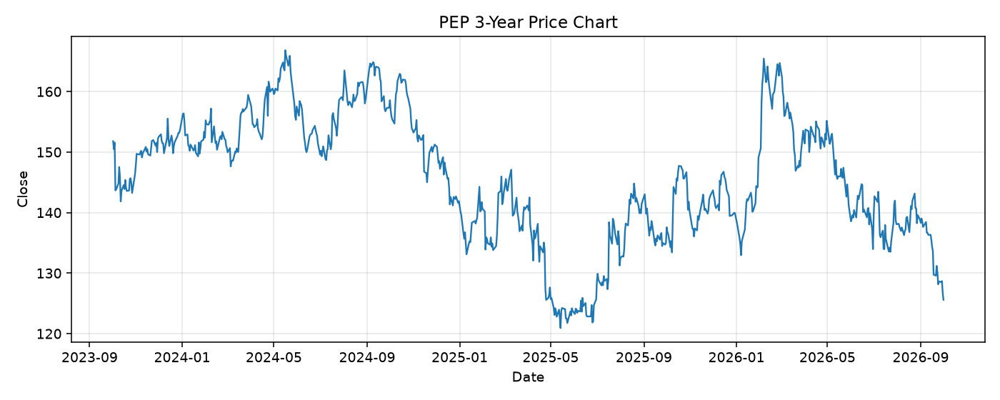

# PEP レポート

> このページの目的: 単一銘柄のファンダメンタル・価格推移・ニュースを確認し、候補採用可否を判断する。

- 最終更新: 2026-10-01 20:30:54 JST
- 実行ID: 2026-10-01-203054

## 基本情報

- **longName**: PepsiCo, Inc.
- **symbol**: PEP
- **sector**: Consumer Defensive
- **industry**: Beverages - Non-Alcoholic
- **country**: United States
- **marketCap**: 171569594368

## 株価チャート（3年）

## 主要指標

- [指標の見方ヘルプ](../../../../indicators.md)

| 指標 | 値 |
|---|---:|
| PER | 16.46 |
| 配当利回り | 467.00% |
| PBR | 7.76 |
| ROE | 51.51% |
| Debt/Equity | 238.95 |
| 売上成長率 | 6.40% |
| Beta | 0.36 |

## yfinance ニュース

- ニュースが取得できませんでした。

## NewsAPI ニュース

- NewsAPI でニュースが取得されませんでした。
