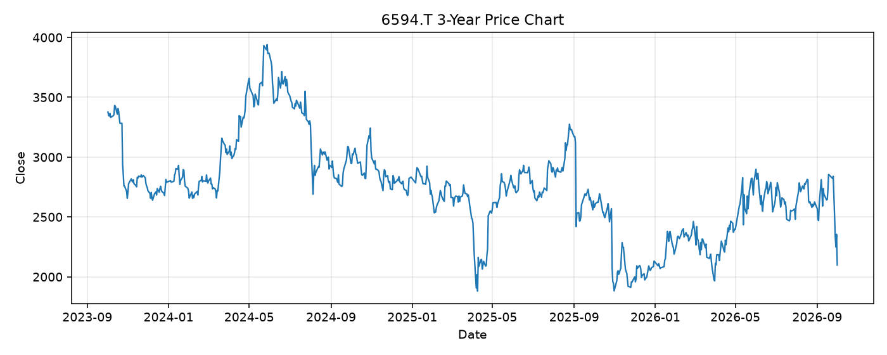

# 6594.T レポート

> このページの目的: 単一銘柄のファンダメンタル・価格推移・ニュースを確認し、候補採用可否を判断する。

- 最終更新: 2026-10-01 20:34:40 JST
- 実行ID: 2026-10-01-203440

## 基本情報

- **longName**: Nidec Corporation
- **symbol**: 6594.T
- **sector**: Industrials
- **industry**: Specialty Industrial Machinery
- **country**: Japan
- **marketCap**: 2410754342912

## 株価チャート（3年）

## 主要指標

- [指標の見方ヘルプ](../../../../indicators.md)

| 指標 | 値 |
|---|---:|
| PER | inf |
| 配当利回り | - |
| PBR | 1.37 |
| ROE | 6.31% |
| Debt/Equity | 40.10 |
| 売上成長率 | 2.90% |
| Beta | 1.05 |

## yfinance ニュース

- ニュースが取得できませんでした。

## NewsAPI ニュース

- NewsAPI でニュースが取得されませんでした。
