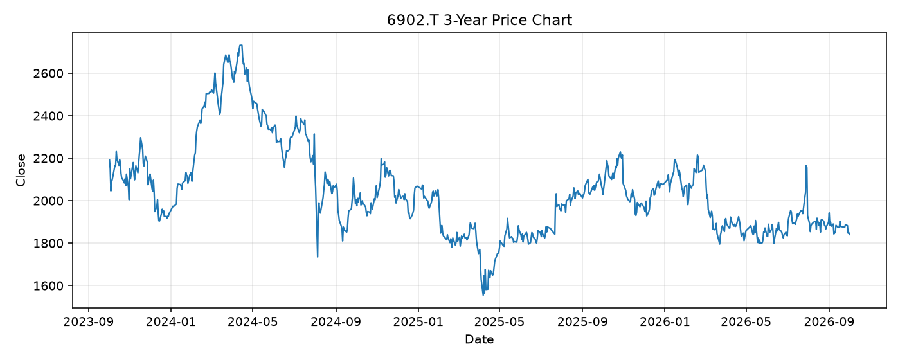

# 6902.T レポート

> このページの目的: 単一銘柄のファンダメンタル・価格推移・ニュースを確認し、候補採用可否を判断する。

- 最終更新: 2026-10-01 20:34:40 JST
- 実行ID: 2026-10-01-203440

## 基本情報

- **longName**: DENSO Corporation
- **symbol**: 6902.T
- **sector**: Consumer Cyclical
- **industry**: Auto Parts
- **country**: Japan
- **marketCap**: 4613138808832

## 株価チャート（3年）

## 主要指標

- [指標の見方ヘルプ](../../../../indicators.md)

| 指標 | 値 |
|---|---:|
| PER | 11.35 |
| 配当利回り | 400.00% |
| PBR | 0.90 |
| ROE | 9.20% |
| Debt/Equity | 25.47 |
| 売上成長率 | 9.10% |
| Beta | 0.62 |

## yfinance ニュース

- ニュースが取得できませんでした。

## NewsAPI ニュース

- NewsAPI でニュースが取得されませんでした。
