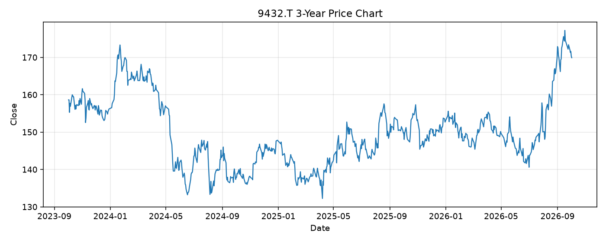

# 9432.T レポート

> このページの目的: 単一銘柄のファンダメンタル・価格推移・ニュースを確認し、候補採用可否を判断する。

- 最終更新: 2026-10-02 20:08:05 JST
- 実行ID: 2026-10-02-200805

## 基本情報

- **longName**: NTT, Inc.
- **symbol**: 9432.T
- **sector**: Communication Services
- **industry**: Telecom Services
- **country**: Japan
- **marketCap**: 13750518153216

## 株価チャート（3年）

## 主要指標

- [指標の見方ヘルプ](../../../../indicators.md)

| 指標 | 値 |
|---|---:|
| PER | 13.48 |
| 配当利回り | 317.00% |
| PBR | 1.40 |
| ROE | 10.71% |
| Debt/Equity | 168.40 |
| 売上成長率 | 10.90% |
| Beta | -0.17 |

## yfinance ニュース

- ニュースが取得できませんでした。

## NewsAPI ニュース

- NewsAPI でニュースが取得されませんでした。
