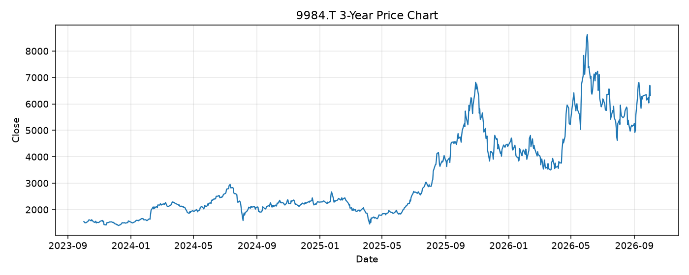

# 9984.T レポート

> このページの目的: 単一銘柄のファンダメンタル・価格推移・ニュースを確認し、候補採用可否を判断する。

- 最終更新: 2026-10-02 20:10:38 JST
- 実行ID: 2026-10-02-201038

## 基本情報

- **longName**: SoftBank Group Corp.
- **symbol**: 9984.T
- **sector**: Communication Services
- **industry**: Telecom Services
- **country**: Japan
- **marketCap**: 35960209276928

## 株価チャート（3年）

## 主要指標

- [指標の見方ヘルプ](../../../../indicators.md)

| 指標 | 値 |
|---|---:|
| PER | 7.68 |
| 配当利回り | 16.00% |
| PBR | 1.97 |
| ROE | 31.96% |
| Debt/Equity | 130.15 |
| 売上成長率 | 10.90% |
| Beta | 1.00 |

## yfinance ニュース

- ニュースが取得できませんでした。

## NewsAPI ニュース

- NewsAPI でニュースが取得されませんでした。
