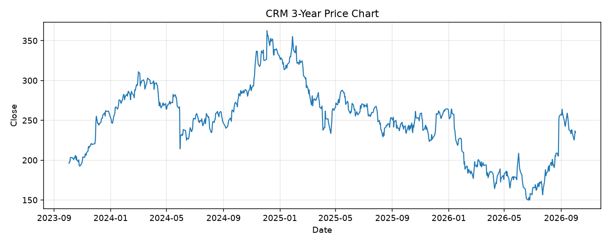

# CRM レポート

> このページの目的: 単一銘柄のファンダメンタル・価格推移・ニュースを確認し、候補採用可否を判断する。

- 最終更新: 2026-10-02 20:10:38 JST
- 実行ID: 2026-10-02-201038

## 基本情報

- **longName**: Salesforce, Inc.
- **symbol**: CRM
- **sector**: Technology
- **industry**: Software - Application
- **country**: United States
- **marketCap**: 193084030976

## 株価チャート（3年）

## 主要指標

- [指標の見方ヘルプ](../../../../indicators.md)

| 指標 | 値 |
|---|---:|
| PER | 21.08 |
| 配当利回り | 74.00% |
| PBR | 5.03 |
| ROE | 19.38% |
| Debt/Equity | 110.42 |
| 売上成長率 | 10.80% |
| Beta | 1.20 |

## yfinance ニュース

- ニュースが取得できませんでした。

## NewsAPI ニュース

- NewsAPI でニュースが取得されませんでした。
