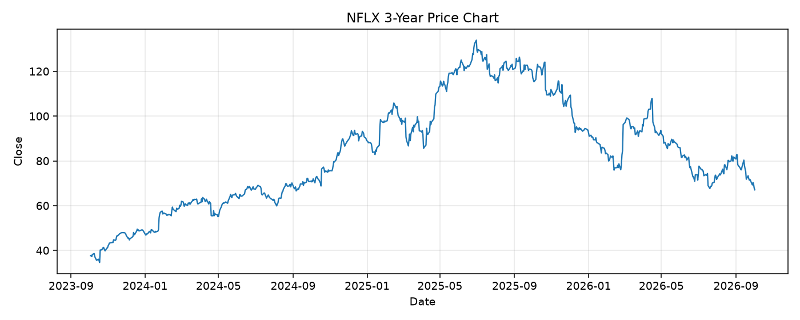

# NFLX レポート

> このページの目的: 単一銘柄のファンダメンタル・価格推移・ニュースを確認し、候補採用可否を判断する。

- 最終更新: 2026-10-04 18:48:09 JST
- 実行ID: 2026-10-04-184809

## 基本情報

- **longName**: Netflix, Inc.
- **symbol**: NFLX
- **sector**: Communication Services
- **industry**: Entertainment
- **country**: United States
- **marketCap**: 279233789952

## 株価チャート（3年）

## 主要指標

- [指標の見方ヘルプ](../../../../indicators.md)

| 指標 | 値 |
|---|---:|
| PER | 21.09 |
| 配当利回り | - |
| PBR | 9.26 |
| ROE | 49.54% |
| Debt/Equity | 55.24 |
| 売上成長率 | 13.40% |
| Beta | 1.53 |

## yfinance ニュース

- ニュースが取得できませんでした。

## NewsAPI ニュース

- NewsAPI でニュースが取得されませんでした。
