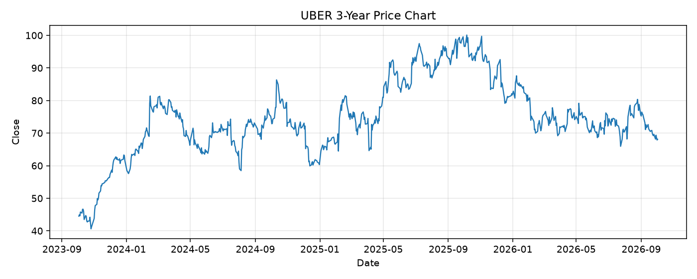

# UBER レポート

> このページの目的: 単一銘柄のファンダメンタル・価格推移・ニュースを確認し、候補採用可否を判断する。

- 最終更新: 2026-10-04 18:51:24 JST
- 実行ID: 2026-10-04-185124

## 基本情報

- **longName**: Uber Technologies, Inc.
- **symbol**: UBER
- **sector**: Technology
- **industry**: Software - Application
- **country**: United States
- **marketCap**: 139118772224

## 株価チャート（3年）

## 主要指標

- [指標の見方ヘルプ](../../../../indicators.md)

| 指標 | 値 |
|---|---:|
| PER | 14.94 |
| 配当利回り | - |
| PBR | 5.09 |
| ROE | 37.16% |
| Debt/Equity | 51.87 |
| 売上成長率 | 12.20% |
| Beta | 1.16 |

## yfinance ニュース

- ニュースが取得できませんでした。

## NewsAPI ニュース

- NewsAPI でニュースが取得されませんでした。
