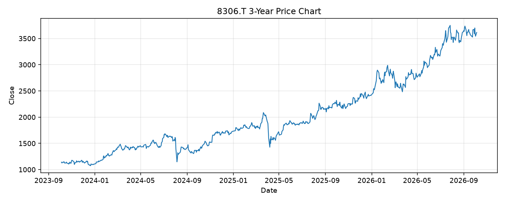

# 8306.T レポート

> このページの目的: 単一銘柄のファンダメンタル・価格推移・ニュースを確認し、候補採用可否を判断する。

- 最終更新: 2026-10-05 22:11:45 JST
- 実行ID: 2026-10-05-221145

## 基本情報

- **longName**: Mitsubishi UFJ Financial Group, Inc.
- **symbol**: 8306.T
- **sector**: Financial Services
- **industry**: Banks - Diversified
- **country**: Japan
- **marketCap**: 40689589026816

## 株価チャート（3年）

## 主要指標

- [指標の見方ヘルプ](../../../../indicators.md)

| 指標 | 値 |
|---|---:|
| PER | 15.29 |
| 配当利回り | 271.00% |
| PBR | 1.79 |
| ROE | 9.46% |
| Debt/Equity | - |
| 売上成長率 | 28.80% |
| Beta | 0.35 |

## yfinance ニュース

- ニュースが取得できませんでした。

## NewsAPI ニュース

- NewsAPI でニュースが取得されませんでした。
