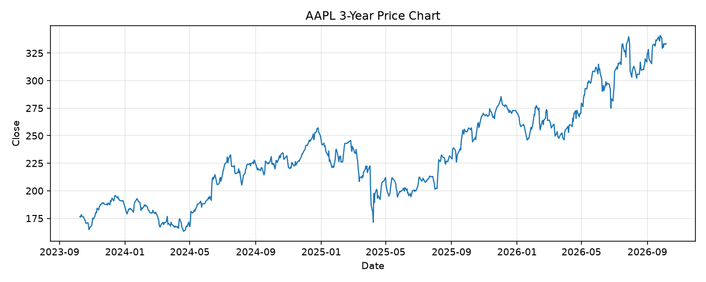

# AAPL レポート

> このページの目的: 単一銘柄のファンダメンタル・価格推移・ニュースを確認し、候補採用可否を判断する。

- 最終更新: 2026-10-06 20:35:42 JST
- 実行ID: 2026-10-06-203542

## 基本情報

- **longName**: Apple Inc.
- **symbol**: AAPL
- **sector**: Technology
- **industry**: Consumer Electronics
- **country**: United States
- **marketCap**: 4869056364544

## 株価チャート（3年）

## 主要指標

- [指標の見方ヘルプ](../../../../indicators.md)

| 指標 | 値 |
|---|---:|
| PER | 38.26 |
| 配当利回り | 32.00% |
| PBR | 45.33 |
| ROE | 148.75% |
| Debt/Equity | 78.44 |
| 売上成長率 | 16.40% |
| Beta | 1.07 |

## yfinance ニュース

- ニュースが取得できませんでした。

## NewsAPI ニュース

- NewsAPI でニュースが取得されませんでした。
