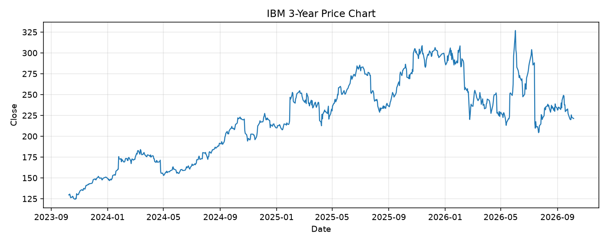

# IBM レポート

> このページの目的: 単一銘柄のファンダメンタル・価格推移・ニュースを確認し、候補採用可否を判断する。

- 最終更新: 2026-10-06 20:35:42 JST
- 実行ID: 2026-10-06-203542

## 基本情報

- **longName**: International Business Machines Corporation
- **symbol**: IBM
- **sector**: Technology
- **industry**: Information Technology Services
- **country**: United States
- **marketCap**: 208484909056

## 株価チャート（3年）

## 主要指標

- [指標の見方ヘルプ](../../../../indicators.md)

| 指標 | 値 |
|---|---:|
| PER | 19.67 |
| 配当利回り | 305.00% |
| PBR | 6.05 |
| ROE | 34.46% |
| Debt/Equity | 188.97 |
| 売上成長率 | 1.10% |
| Beta | 0.72 |

## yfinance ニュース

- ニュースが取得できませんでした。

## NewsAPI ニュース

- NewsAPI でニュースが取得されませんでした。
